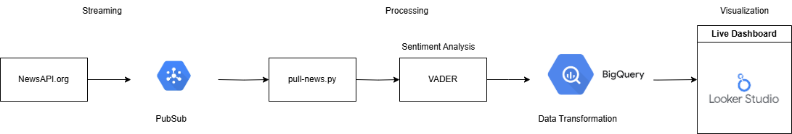

# 📰 Real-Time News Sentiment Dashboard – Built with GCP + NLP + Looker Studio

This project is a full-stack, real-time sentiment analysis pipeline that streams live news headlines, scores their sentiment using NLP, stores the enriched data in BigQuery, and visualizes insights using Looker Studio.

---

## 🚀 Tech Stack

- **Python** – for ingestion, processing & Pub/Sub communication
- **Google Cloud Platform (GCP)**:
  - Pub/Sub – Real-time messaging
  - BigQuery – Structured storage + analytics
- **VADER** (from `nltk`) – Sentiment analysis
- **Looker Studio** – Live dashboard with filters, trends, and visuals
- **NewsAPI.org** – Live headlines data source

---

## 🔄 Data Flow (Pipeline Overview)

1. `newsapi.org` → fetch headlines (via `push_news.py`)
2. → Published to **GCP Pub/Sub**
3. → Consumed by `pull_news.py` subscriber
4. → Sentiment scored using **VADER**
5. → Data stored in **BigQuery** table: `sentiment_log`
6. → Deduplicated via view: `unique_sentiment_today`
7. → Visualized in **Looker Studio**

---

## 🧪 Features

- Live headline ingestion + sentiment tagging
- NLP-powered classification (Positive, Negative, Neutral)
- Auto-categorization (Politics, Tech, Sports, Other)
- Hourly sentiment breakdown
- Fully interactive Looker dashboard with filters
- Real-time data feed table + historical trends

---

## 📂 Project Structure

